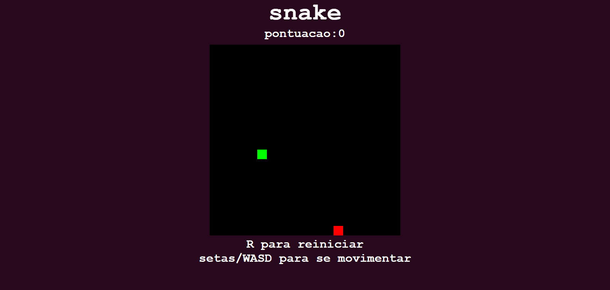

# SNAKE GAME

### Jogo snake clássico desenvolvido em HTML, CSS e JS puro.

## Screenshot



## Tecnologias

- HTML
- HTML Canvas
- CSS
- JavaScript

## Funcionalidades

- Contabilizar pontos
- Tela de game over ao bater em uma parede ou no corpo da cobra

## Como executar

1. Clone o repositório

```bash
git clone https://github.com/micardosofph/Snake_Game
```

2. Abra index.html no navegador

## To Dos

- Detectar ao completar o tamanho do mapa inteiro
- Movimentação suave
- personalização da velocidade, tamanho
